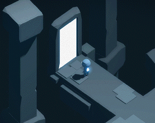
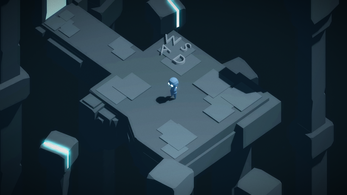
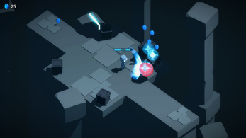
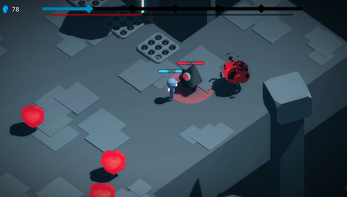

# Cybertale

A game made on game jam in 72 hours. It's a small roguelike game with dynamic battles and a boss at the end. You can play it on [itch page](https://scrawach.itch.io/cybertale).

# Screenshots

  
   
  

# Gameplay

